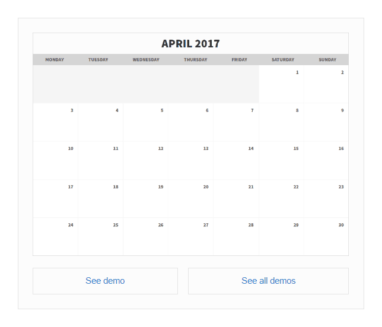

# Demos Plugin

This plugin inserts a demo box inside article.

  

## Features

* Set custom demo content
* Optional button to show "See demo" link
* Optional button to show "See all demos" link

## Installation

Copy contents to your `wp-content/plugins` directory or upload ZIP with repo contents via Wordpress admin (Plugins/Add new/Upload plugin).

## License

Copyright © 2017 Krzysztof Antoniak (http://antoniak.in/). Licensed under GNU General Public License, version 3.0 (GPL-3.0).